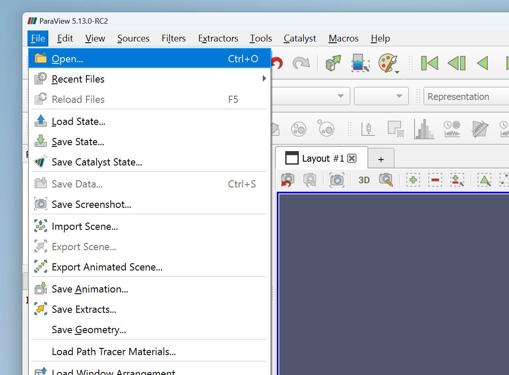

## Install ParaView
Install Paraview from <https://www.paraview.org/download/>

## Run a simple linear elasticity problem
We will look at a simple cantilever beam under self-load. Get the jupyter notebook [here](../quickstart_file/2D_elasticity.ipynb)

## Run the whole notebook at once 

## Visualize
After running the code you will see two new files **elasticity_results.h5** and **elasticity_results.xdmf** in the directory.

Open Paraview and load the xdmf file.

* Locate the xdmf file and open it.
* Select the default reader: Xdmf3 Reader S

