## Install Salome
Install salome from <https://www.salome-platform.org/>
Go to downloads and select your OS.

## Open SALOME
After you install and open salome, the first interface should look something like this:

* Click on the shaper
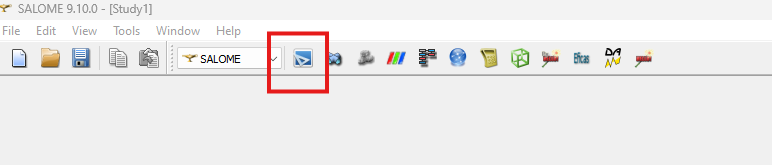

* You should see a window like this:
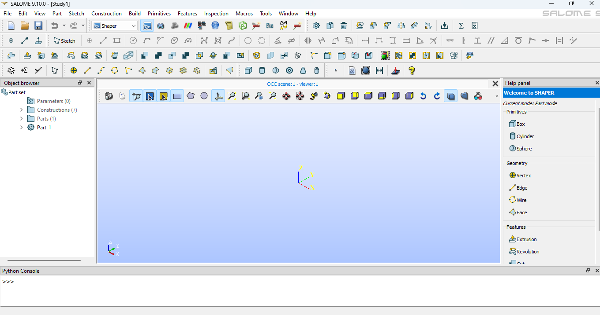

## Now we will try to draw a rectangle with a hole in it

* Click on the "Sketch" tab or selection sketch from the "Sketch" in the upper toolbar

* After clicking it you will be asked to choose a plane. Select ZX plane, which should be green in colour. There are 3 colours Red Green and Blue. Lets select Green now. The orientation might look different.

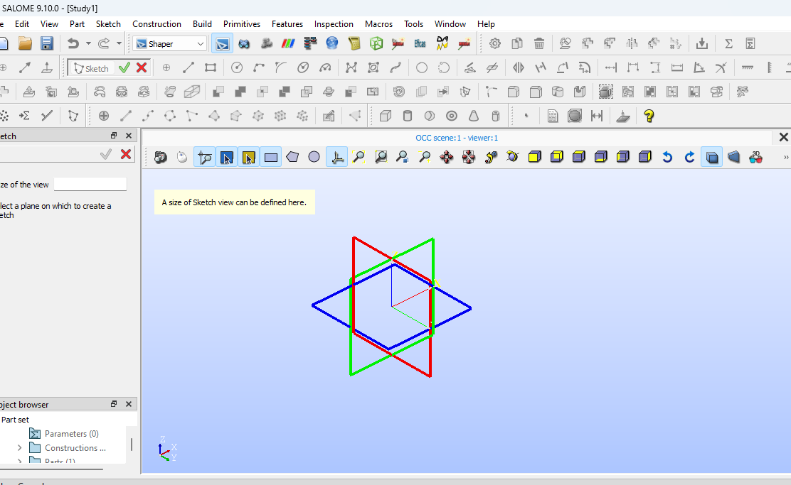

* After selecting the Green rectangle, also click "Set plane view"

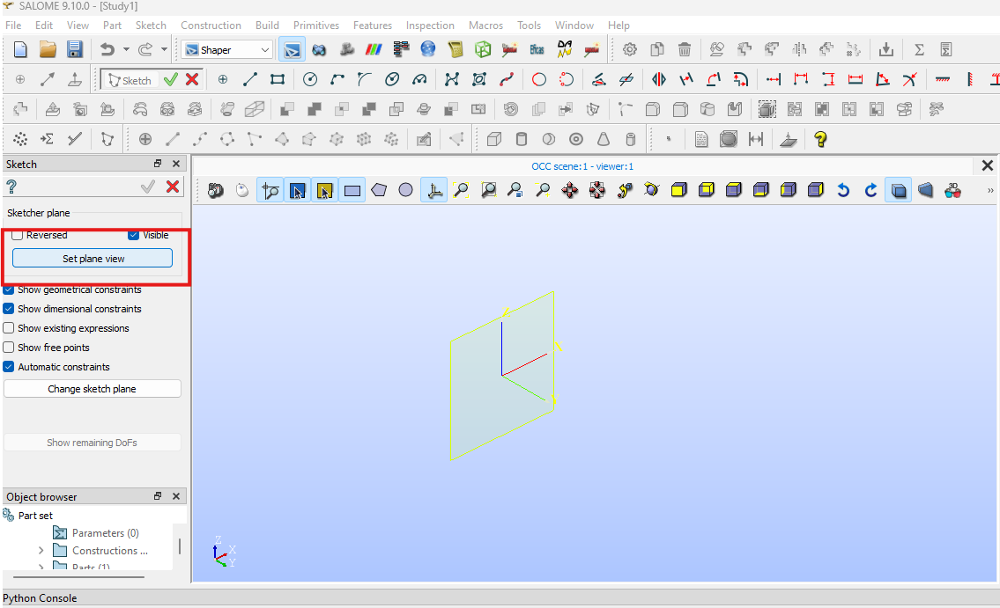

* Now you will see the ZX plane as shown:

* Here we will draw a rectangle using "Rectangle" tool as shown:

* After clicking on the rectangle, take your mouse closer to the center, a blue dot will be highlighted, i.e. your mouse will now snap to the center. Click here.

* After clicking move your mouse any where in the first quadrant and click for the second time. You will see something like this:

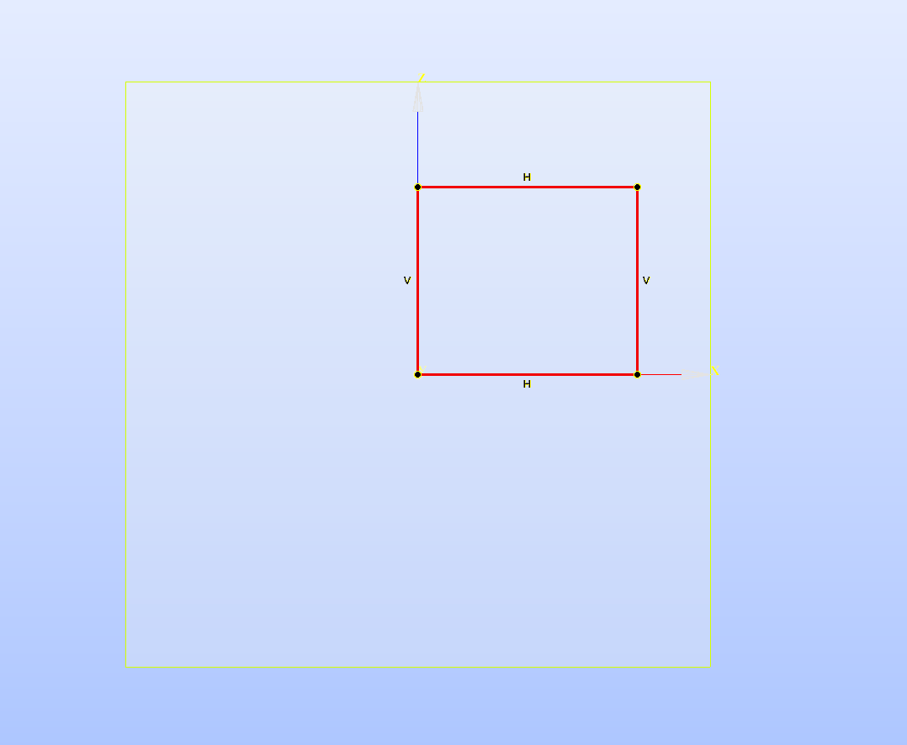

* Now we will constraint the dimensions parametrically. Then click length in the top panel as shown

* Now click on any horizontal line

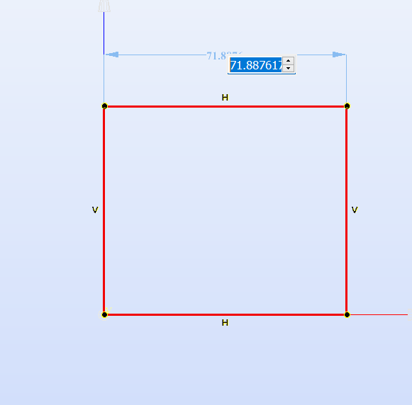

* Now drag a little up and click. After you click the text box will be shown. in the text box type "L=50"

* Press enter. Now notice two things one the dimension has been set, and next a new parameter "L" has been created whose value can be changed parametrically and whose change will be reflected.

* Now click on the green tick arrow for confirmation

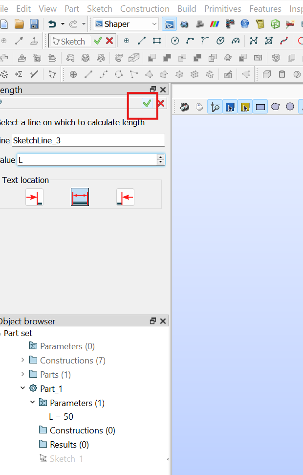

* Repeat the process for vertical lines, in the text box that appears put "H=40". Press "Enter" and click the green arrow for confirmation

* We have our rectangle ready. Now lets draw a circle. Click on the circle icon as shown:

* After that click on any point inside the rectangle and then mouse your mouse around for specifying for radius. Right now just keep it whatever you want. Get something line this:

You can see that the circle is red. Red in salome is unconstrained. Green is constrained. Now we will constrain our circle. First we will specify the radius parametrically.

* Click on the radius as shown:

* After clicking on circle you will see something like:

* Now click again so that the text box appears: In the box put r = 10

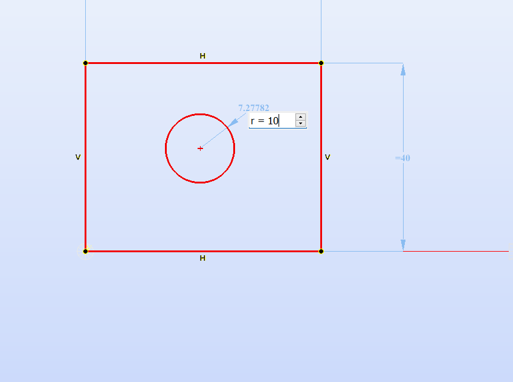

Press Enter and tick the green arrow like before.

* Great work. Now we have circle and a rectangle whose dimensions can be parametrically changed.

* The final thing is to contrain the circle in the centre of rectangle to do that draw a diagonal as follows:

Click the line:

Then draw a diagonal by clicking two ends of the rectangle as:

* Now we will use mid point contraint to fix the center of circle to the center of diagonal.

* To do that first click on the "Middle point" constraint:

* You will see a side panel like:

* For the first object, now click the center of circle. After clicking you will see:

* Then select the diagonal

* Doing this will immediately move the circle to the center and everything will be green as above. Then click the tick mark.

* Now we have drawn the sketch completely. A sketch consists of lines only. We make use of this lines to draw further shapes.

To mark completion click green tick as shown:

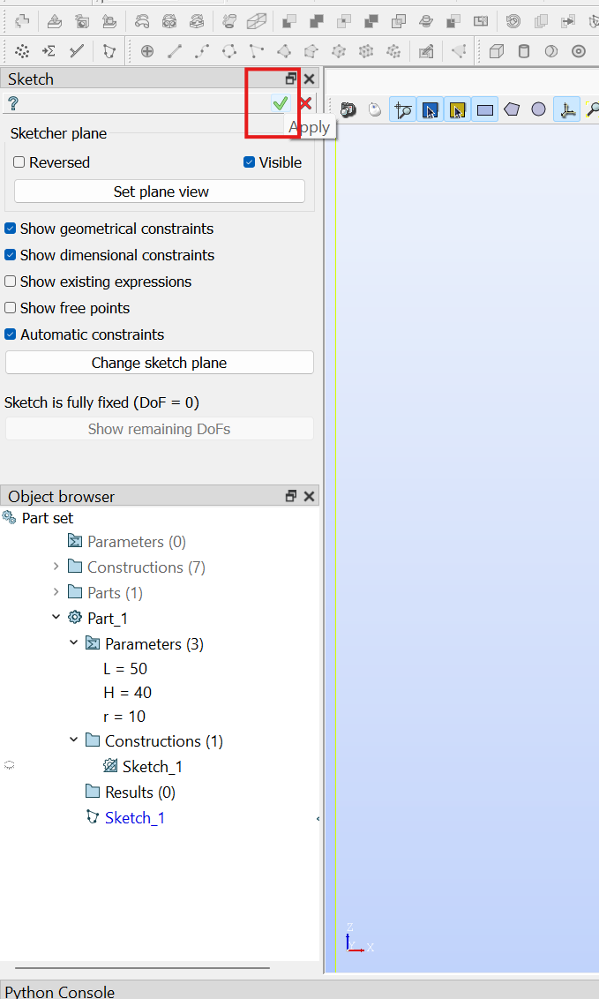

* After click tick everything will be greyed out and look like this:

* Now try chaning the parameters and see if there is any effect:

* Double click on L as shown:

* Change the 50 to 60 as shown:

* Click the green tick:
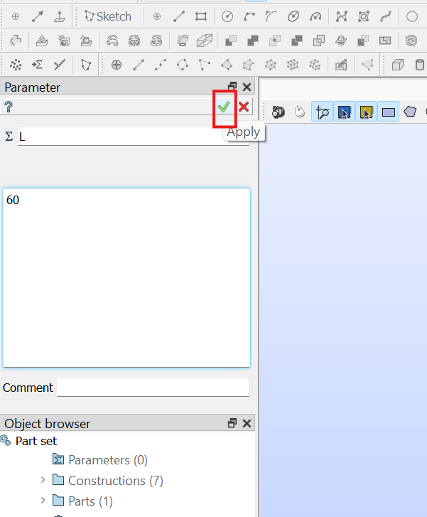

* You will see that the figure stretches:

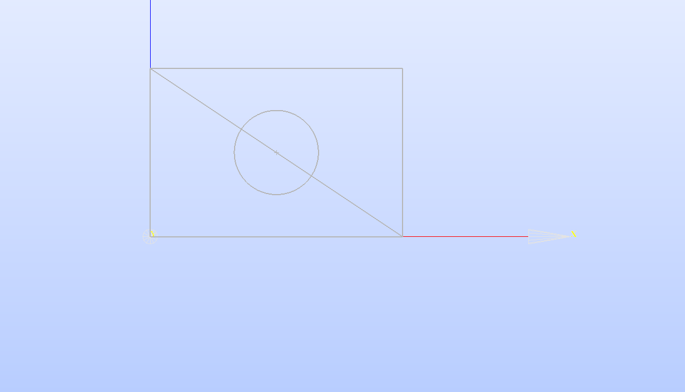

* Now lets add faces. To add faces click "Face":

* Just hover around the upper half to see:

* Click on the upper right corner area and then "SHIFT+ CLICK" on the bottom left to get:

* Then click the green tick

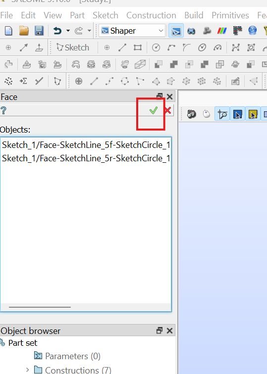

* You will see something like:

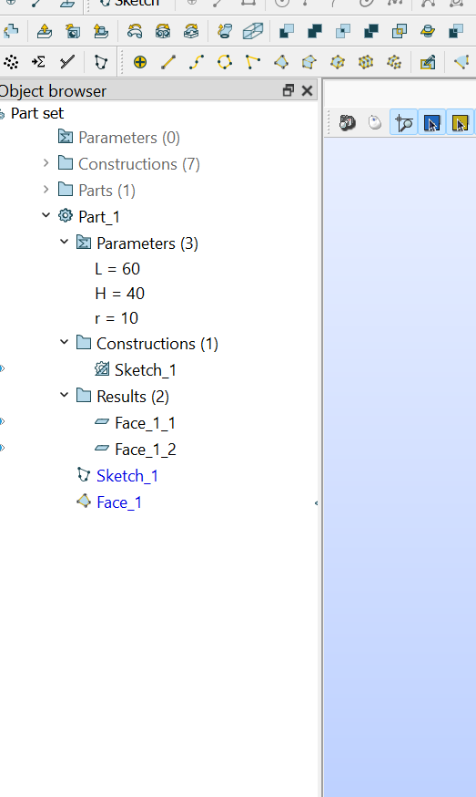

* Finally we will merge those two halves into one for meshing. Click on "Fuse"

* Click on Face_1_1 first, then shift click on Face_1_2

* Then Click on the green tick

* You will se a fuse item here:

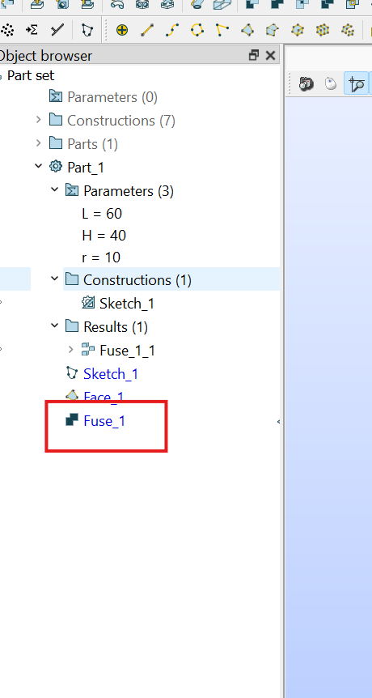
