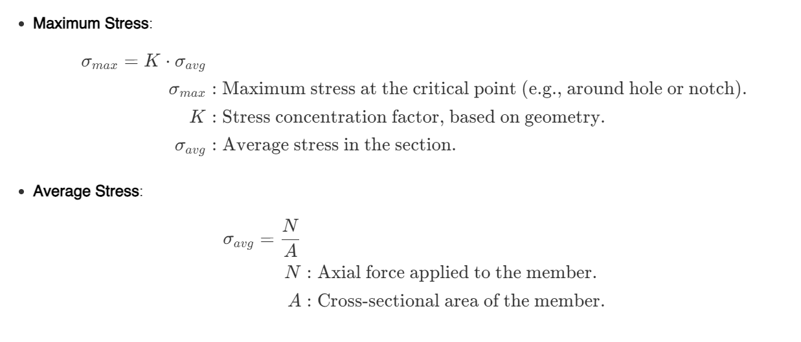
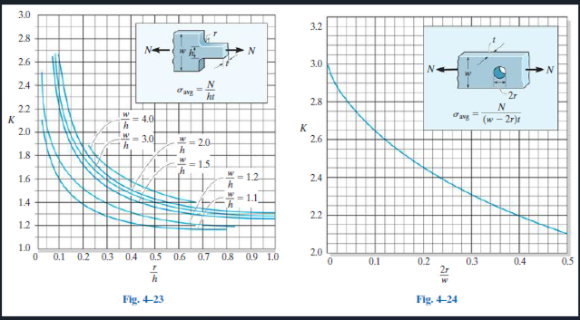

## Stress Concentration
Stress concentrations occur at locations where there are abrupt changes in the cross-sectional area of a component, such as holes, notches, or grooves (e.g., Figures 4-20 and 4-21). These discontinuities disrupt the uniform flow of stress, resulting in localized areas of higher stress, which can significantly affect the performance and safety of a structure.
In engineering design and analysis, the primary goal is to determine the **maximum stress** at critical locations, particularly at the smallest cross-sectional area. This is done using the **stress concentration factor** \(K\), which is a dimensionless multiplier derived from experimental or theoretical studies, and depends solely on the geometry of the discontinuity.
### Equations:

---

## Example of Computing \(K \) (Figures 4-23 and 4-24)
This figure  4-24 demonstrates stress concentration factors for **notched plates**:
Stress concentration factors are critical for accurately predicting maximum stresses in components with geometric discontinuities. Using experimental data (e.g., Figures 4-23 and 4-24), designers can ensure components are safe and reliable under applied loads.
 In brittle materials, cracks can start at maximum stress points and quickly cause fracture, so these factors are crucial for design 

